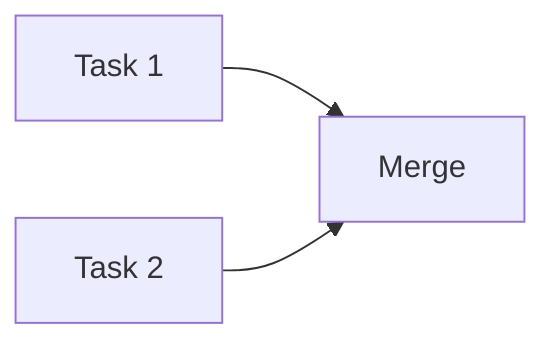

# Web UI Branch Tracker

**Session:** <% tp.file.cursor(2) %>
**Date:** <% tp.date.now("YYYY-MM-DD") %>

---

## Active Web UI Workers

| Task | Branch | Status | Started | PR/Merge |
|------|--------|--------|---------|----------|
| <% tp.file.cursor(3) %> | `pending...` | ⏸️ Pending | - | - |

---

## Branch Monitoring Commands

**Check for new Web UI branches:**
```bash
git fetch origin
git branch -r | grep claude/
```

**Check specific branch status:**
```bash
git log origin/claude/[branch] --oneline -5
```

**Compare with main:**
```bash
git diff main..origin/claude/[branch] --stat
```

---

## Completed Web UI Tasks

| Task | Branch | Completed | Merge Method | Final Commit |
|------|--------|-----------|--------------|--------------|
| Example | `claude/example-abc123` | 2025-11-07 10:00 | PR #123 | `abc123` |

---

## Branch Cleanup Log

**Deleted branches:**
```bash
# After merge, delete remote branch
git push origin --delete claude/[branch-name]
```

| Branch | Deleted | Reason |
|--------|---------|--------|
| `claude/migrate-moku-go-yaml-011CUtv75gH4JpVXDYFFQcQV` | 2025-11-07 | Merged to main |
| `claude/moku-network-connectivity-exploration-011CUtvzrTE8LHCkRoNeUjA4` | 2025-11-07 | Merged to main |

---

## Parallel Task Coordination

**Maximum parallel workers:** 3-5 (depending on task independence)

**Current parallel tasks:**
1. <% tp.file.cursor(4) %>

**Task dependencies:**


---

## Statistics

- **Total Web UI tasks launched:** <% tp.file.cursor(5) %>
- **Successfully merged:** <% tp.file.cursor(6) %>
- **Average completion time:** <% tp.file.cursor(7) %>
- **Time saved via parallelization:** <% tp.file.cursor(8) %>

---

## Notes

- Web UI branches are ephemeral - delete after merge
- Each Web UI gets fresh 200k token context
- Tasks must be independent for parallel execution
- Always review before merging

---

**See Also:**
- [[Obsidian/Project/Web-UI-Coordination-Pattern]]
- [[.claude/commands/coordinate_web_ui]]